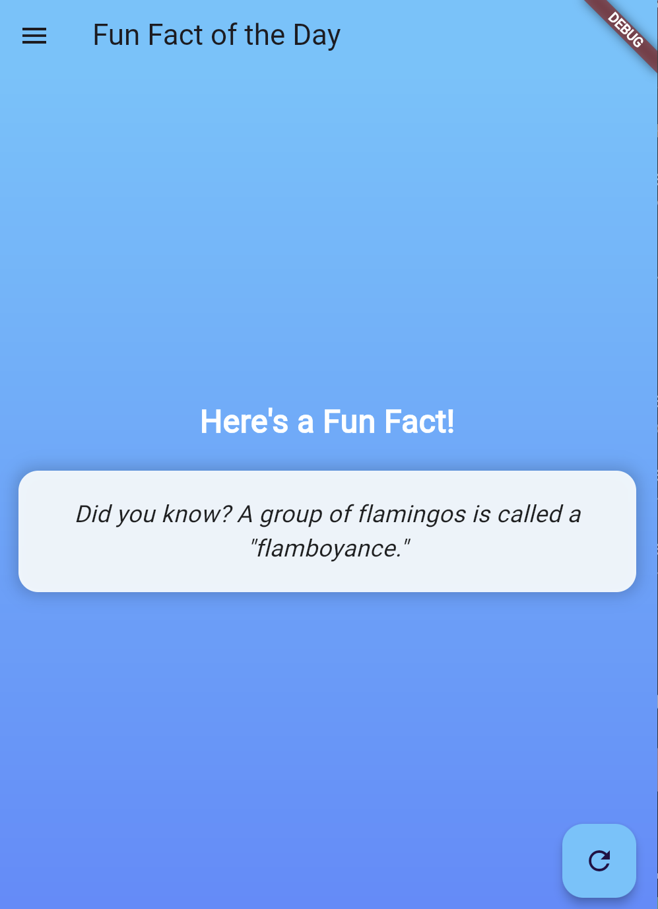
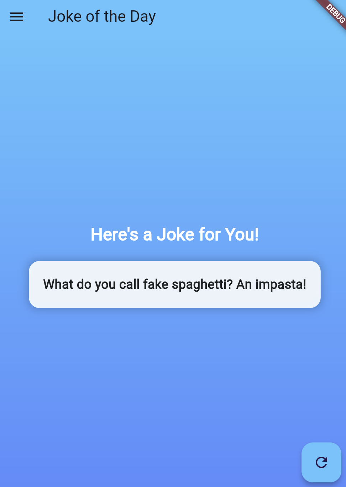

Jasmine Adzra Fakhirah
H1D022071
Prak pemob shift D

```markdown
# FunApp

FunApp is a Flutter application that provides users with fun facts and jokes of the day. The app features a simple and intuitive user interface with a side navigation menu for easy access to different sections.

## Directory Structure

- `lib/`
  - `main.dart`: The entry point of the Flutter application.
  - `funfact_page.dart`: Contains the `FunfactPage` widget, which displays a fun fact.
  - `joke_page.dart`: Contains the `JokePage` widget, which displays a joke.
  - `sidemenu.dart`: Contains the `Sidemenu` widget, which serves as a navigation drawer.

## Important Code Sections

### main.dart

This is the main entry point of the application. It initializes the Flutter app and sets up the home page, which includes the `Sidemenu`.

```dart
void main() {
  runApp(const MyApp());
}
```

### funfact_page.dart

#### `FunfactPage`

This widget displays a random fun fact. It includes:

- A list of fun facts.
- A method `_loadFunFact()` to select a fun fact based on the current day.
- A floating action button that allows users to refresh the fun fact.

```dart
class FunfactPage extends StatefulWidget {
  const FunfactPage({Key? key}) : super(key: key);
}
```

### joke_page.dart

#### `JokePage`

Similar to `FunfactPage`, this widget shows a joke of the day. Key components include:

- A list of jokes.
- A method to select a joke based on the current day.
- A floating action button for refreshing the joke.

```dart
class JokePage extends StatelessWidget {
  const JokePage({super.key});
}
```

### sidemenu.dart

#### `Sidemenu`

This widget provides a navigation drawer for the app. It contains:

- A gradient background that matches the app's theme.
- A list of menu items for navigating to the `FunfactPage` and `JokePage`.
- Icons and text styled for better visibility and consistency.

```dart
class Sidemenu extends StatelessWidget {
  const Sidemenu({Key? key}) : super(key: key);
}
```

